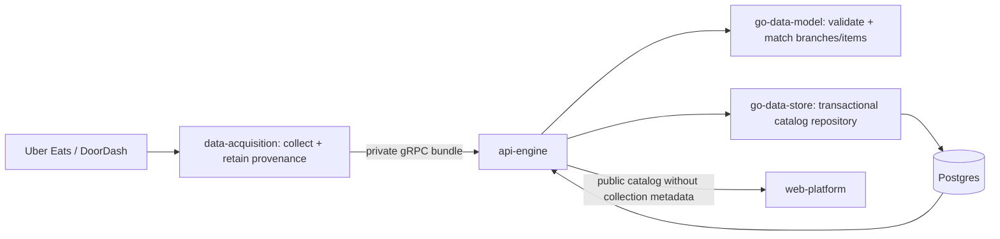

# Catalog architecture and local operation



Ownership:
- **data-acquisition:** discovery, provider parsing, raw archives, 12/24h schedule,
  retries and the gRPC publisher. No customer server or cross-provider matching.
- **platform-contracts:** internal envelope schema and public response semantics.
- **go-data-model:** validation, reviewed branch evidence, conservative item
  identity, missing-price status and customer projection.
- **go-data-store:** immutable import history and normalized current provider,
  store and item read tables; atomic import and repeatable-read catalog queries.
- **api-engine:** private ingestion and public `GET /v1/catalog` orchestration.
- **web-platform:** restaurant → menu → item comparisons, provider logos,
  addresses, honest missing-price/fee states. Login/intro appearance preserved.

The browse read model is separate from existing quote/checkout tables. It does
not fabricate fulfillment context or feed unknown fees into checkout. Extending
address-specific quotes should use the existing quote domain. Canonical catalog
IDs use reviewed branch IDs; equal brand names alone never merge branches.
Sizes, quantities and meal variants remain distinct. Ambiguous same-name source
items are not matched to another provider's price.

## Reproducible stack

Check out all seven repositories as siblings and run:

```sh
cd nibble-local-dev
docker compose up --build -d
```

Builds consume sibling modules, including pinned private module graphs, through
Go workspaces. No GitHub token is passed into images. Go module release tags do not include these coordinated changes yet. Standalone
vendored CI includes the first-party additions via `scripts/sync-catalog-vendor.py`
(see each consumer’s `VENDOR-PATCHES.md`). Publish and pin coordinated module
releases before returning to normal vendor regeneration.

Postgres and acquisition archives use named volumes. Do not delete volumes
when restarting. The API's public port is 8080; private development ingest is
bound to loopback on 9090. The web runs at 5173 in Compose. A host Vite server
may use 5174 and proxies `/api` to the same API. Ports 8091/8092 are obsolete.
Never start two workers against the same archive volume.

For Go tests without a host Go installation, mount the sibling workspace into
`golang:1.23-bookworm`, use `nibble-local-dev` as working directory, then run
`go test ../nibble-go-data-model/... ../nibble-go-data-store/...
../nibble-api-engine/... ../nibble-data-acquisition/...`.

Collection timestamps, crawl ages, failures and schedules remain private.
Public prices are not represented as live quotes. Uber menu coverage remains
limited; missing provider prices are explicit, not copied from the other app.
