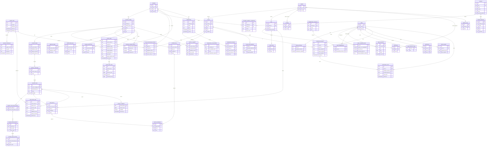

```mermaid
erDiagram
  INGEST_RUN ||--o{ SOURCE_SNAPSHOT : captures
  INGEST_RUN ||--o{ ITEM_PRICE_OBS : produces
  INGEST_RUN ||--o{ QUOTE_OBS : produces

  CHANNEL ||--o{ SOURCE_STORE : lists
  SOURCE_STORE ||--o{ SOURCE_MENU : has
  SOURCE_MENU ||--o{ SOURCE_CATEGORY : sections
  SOURCE_CATEGORY ||--o{ SOURCE_ITEM : contains
  SOURCE_ITEM ||--o{ SOURCE_ITEM_MOD_GROUP : has
  SOURCE_MOD_GROUP ||--o{ SOURCE_MOD_OPTION : choices
  SOURCE_ITEM_MOD_GROUP }o--|| SOURCE_MOD_GROUP : uses

  BRAND ||--o{ PLACE : operates
  BRAND ||--o{ DISH : catalog
  BRAND }o--o{ CUISINE : brand_cuisines
  BRAND }o--o{ CATEGORY : brand_categories
  DISH }o--o{ CATEGORY : food_categories
  DISH ||--o{ DISH_ALIAS : aliases
  BRAND ||--o{ BRAND_ALIAS : aliases

  CHANNEL ||--o{ CHANNEL_MARKET_COVERAGE : covers
  MARKET ||--o{ CHANNEL_MARKET_COVERAGE : in
  MARKET ||--o{ PROBE_DROPOFF : probes

  PLACE ||--o{ PLACE_PURCHASE_OPTION : offers
  CHANNEL ||--o{ PLACE_PURCHASE_OPTION : via
  SOURCE_STORE ||--o{ PLACE_PURCHASE_OPTION : backs

  SOURCE_STORE ||--o{ STORE_MATCH : maps
  PLACE ||--o{ STORE_MATCH : maps
  STORE_MATCH ||--o{ MATCH_EVIDENCE : supports

  SOURCE_ITEM ||--o{ ITEM_MATCH : maps
  DISH ||--o{ ITEM_MATCH : maps
  ITEM_MATCH ||--o{ MATCH_EVIDENCE : supports

  SOURCE_STORE ||--o{ SERVICE_AREA : covers
  SOURCE_STORE ||--o{ HOURS_REGULAR : open
  SOURCE_STORE ||--o{ HOURS_EXCEPTION : exception
  SOURCE_STORE ||--o| SOURCE_STORE_STATUS : status

  SOURCE_ITEM ||--o{ ITEM_PRICE_OBS : priced

  SOURCE_STORE ||--o{ QUOTE_OBS : quoted
  CHANNEL ||--o{ QUOTE_OBS : channel
  QUOTE_OBS ||--o{ QUOTE_FEE_LINE : stack

  CHANNEL ||--o{ PROMOTION : runs
  PROMOTION ||--o{ PROMOTION_CONSTRAINT : rules
  PROMOTION ||--o{ PROMOTION_TARGET : scopes
  MEMBERSHIP_PRODUCT ||--o{ USER_MEMBERSHIP : declared

  USER ||--|| USER_SETTINGS : has
  USER ||--|| USER_COMPARE_PREF : filters
  USER ||--o{ USER_DROPOFF : addresses
  USER ||--o{ USER_MEMBERSHIP : memberships
  USER ||--o{ USER_DIETARY_PREF : prefs
  USER ||--o{ WATCHLIST : watches
  USER ||--o{ PRICE_ALERT : alerts
  USER ||--o{ COMPARE_SESSION : runs
  PLACE ||--o{ COMPARE_SESSION : at
  COMPARE_SESSION ||--o{ OUTBOUND_CLICK : tracks
  USER ||--o{ OUTBOUND_CLICK : clicks

  SOURCE_ITEM ||--o| LISTING_CURRENT : current
  SOURCE_STORE ||--o| QUOTE_CURRENT : current
  PLACE ||--o{ PLACE_PATH_MATRIX : matrix

  INGEST_RUN {
    text id PK
    text job_type
    text channel_id FK
    timestamptz started_at
    timestamptz finished_at
  }

  SOURCE_SNAPSHOT {
    text id PK
    text ingest_run_id FK
    text raw_json
    text checksum
    timestamptz observed_at
  }

  CHANNEL {
    text id PK
    text slug UK
    text kind
    text name
  }

  MARKET {
    text id PK
    text slug UK
    text name
    text country
    text status
    text geohash_prefixes
  }

  PROBE_DROPOFF {
    text id PK
    text market_id FK
    text label
    float lat
    float lng
    text geohash
  }

  CHANNEL_MARKET_COVERAGE {
    text id PK
    text channel_id FK
    text market_id FK
    text status
    int store_count
  }

  SOURCE_STORE {
    text id PK
    text channel_id FK
    text external_store_id
    text name
    float lat
    float lng
  }

  SOURCE_MENU {
    text id PK
    text source_store_id FK
    text fulfillment_mode
    text delivery_executor
    text external_menu_id
  }

  SOURCE_CATEGORY {
    text id PK
    text source_menu_id FK
    text name
  }

  SOURCE_ITEM {
    text id PK
    text source_category_id FK
    text external_item_id
    text name
    boolean available
  }

  SOURCE_MOD_GROUP {
    text id PK
    text external_id
    int min_select
    int max_select
  }

  SOURCE_MOD_OPTION {
    text id PK
    text source_mod_group_id FK
    text name
    bigint price_cents
  }

  SOURCE_ITEM_MOD_GROUP {
    text source_item_id FK
    text source_mod_group_id FK
  }

  BRAND {
    text id PK
    text slug UK
    text name
  }

  PLACE {
    text id PK
    text brand_id FK
    text name
    float lat
    float lng
    text address
  }

  DISH {
    text id PK
    text brand_id FK
    text name
    text canonical_name
  }

  DISH_ALIAS {
    text id PK
    text dish_id FK
    text alias
  }

  BRAND_ALIAS {
    text id PK
    text brand_id FK
    text alias
  }

  CUISINE {
    text id PK
    text slug UK
    text name
  }

  CATEGORY {
    text id PK
    text slug UK
    text name
  }

  PLACE_PURCHASE_OPTION {
    text id PK
    text place_id FK
    text channel_id FK
    text fulfillment_mode
    text delivery_executor
    text source_store_id FK
  }

  STORE_MATCH {
    text id PK
    text source_store_id FK
    text place_id FK
    float confidence
    text status
  }

  ITEM_MATCH {
    text id PK
    text source_item_id FK
    text dish_id FK
    float confidence
    text status
  }

  MATCH_EVIDENCE {
    text id PK
    text signal_kind
    float score
    text note
  }

  SERVICE_AREA {
    text id PK
    text source_store_id FK
    text fulfillment_mode
    text geometry
  }

  HOURS_REGULAR {
    text id PK
    text source_store_id FK
    int day_of_week
    time opens
    time closes
  }

  HOURS_EXCEPTION {
    text id PK
    text source_store_id FK
    date on_date
    boolean closed
  }

  SOURCE_STORE_STATUS {
    text source_store_id PK
    boolean open_now
    boolean paused
    timestamptz observed_at
  }

  ITEM_PRICE_OBS {
    text id PK
    text source_item_id FK
    text ingest_run_id FK
    bigint amount_cents
    text currency
    text fulfillment_mode
    text delivery_executor
    timestamptz observed_at
  }

  QUOTE_OBS {
    text id PK
    text source_store_id FK
    text channel_id FK
    text fulfillment_mode
    text delivery_executor
    text dropoff_geohash
    text membership_tier
    text quote_kind
    bigint basket_subtotal_cents
    timestamptz observed_at
  }

  QUOTE_FEE_LINE {
    text id PK
    text quote_obs_id FK
    text kind
    bigint amount_cents
    numeric percent
    bigint threshold_cents
  }

  PROMOTION {
    text id PK
    text channel_id FK
    text name
    text kind
    timestamptz starts_at
    timestamptz ends_at
  }

  PROMOTION_CONSTRAINT {
    text id PK
    text promotion_id FK
    bigint min_subtotal_cents
    text code
    boolean membership_required
  }

  PROMOTION_TARGET {
    text id PK
    text promotion_id FK
    text place_id FK
    text source_store_id FK
    text source_item_id FK
    text dish_id FK
  }

  MEMBERSHIP_PRODUCT {
    text id PK
    text channel_id FK
    text name
    text slug
  }

  USER {
    text id PK
    text name
    text email
  }

  USER_SETTINGS {
    text user_id PK
    text preferred_currency
    boolean notifications_enabled
  }

  USER_COMPARE_PREF {
    text user_id PK
    boolean willing_to_use_aggregator
    boolean drive_thru_ok
    boolean merchant_direct_ok
    json allowed_fulfillment_modes
  }

  USER_DROPOFF {
    text id PK
    text user_id FK
    float lat
    float lng
    text label
    boolean current
  }

  USER_MEMBERSHIP {
    text id PK
    text user_id FK
    text membership_product_id FK
  }

  USER_DIETARY_PREF {
    text user_id FK
    text tag
  }

  WATCHLIST {
    text id PK
    text user_id FK
    text place_id FK
    text dish_id FK
  }

  PRICE_ALERT {
    text id PK
    text user_id FK
    bigint threshold_cents
    json filter_snapshot
  }

  COMPARE_SESSION {
    text id PK
    text user_id FK
    text place_id FK
    json query_snapshot
    json basket_snapshot
    json result_snapshot
    timestamptz created_at
  }

  OUTBOUND_CLICK {
    text id PK
    text user_id FK
    text compare_session_id FK
    text purchase_option_id
    text action_kind
    timestamptz clicked_at
  }

  LISTING_CURRENT {
    text source_item_id PK
    bigint amount_cents
    boolean available
    timestamptz observed_at
  }

  QUOTE_CURRENT {
    text id PK
    text source_store_id FK
    text dropoff_geohash
    text fulfillment_mode
    bigint all_in_cents
    text quote_kind
  }

  PLACE_PATH_MATRIX {
    text place_id FK
    text purchase_option_id FK
    boolean serviceable
    text dropoff_geohash
  }
```
