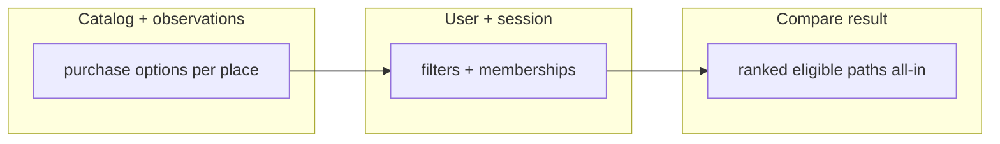
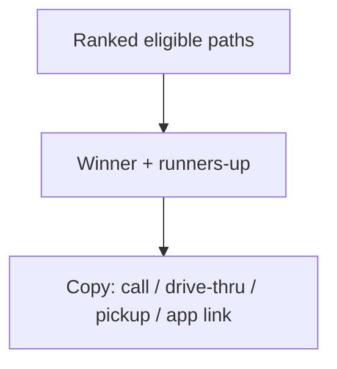
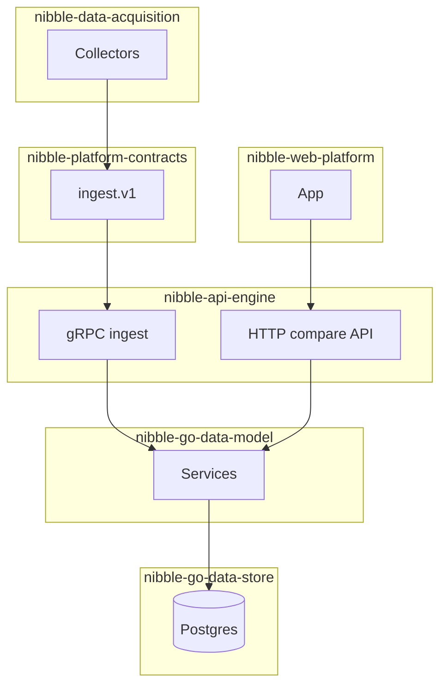
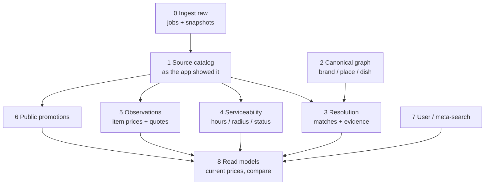
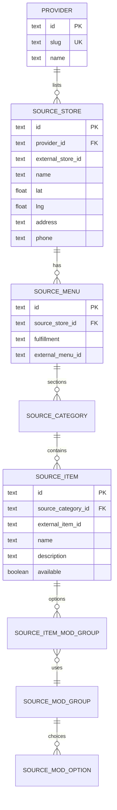
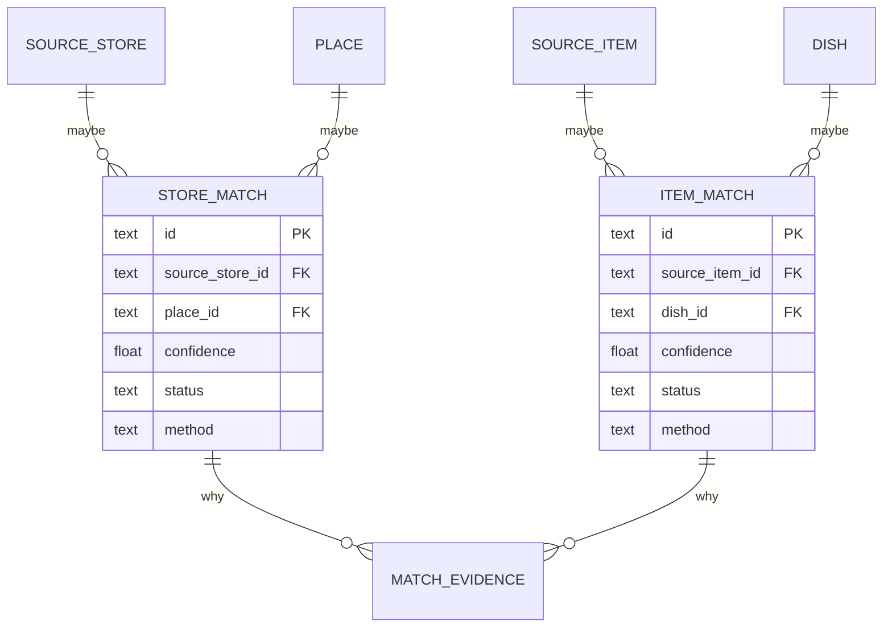
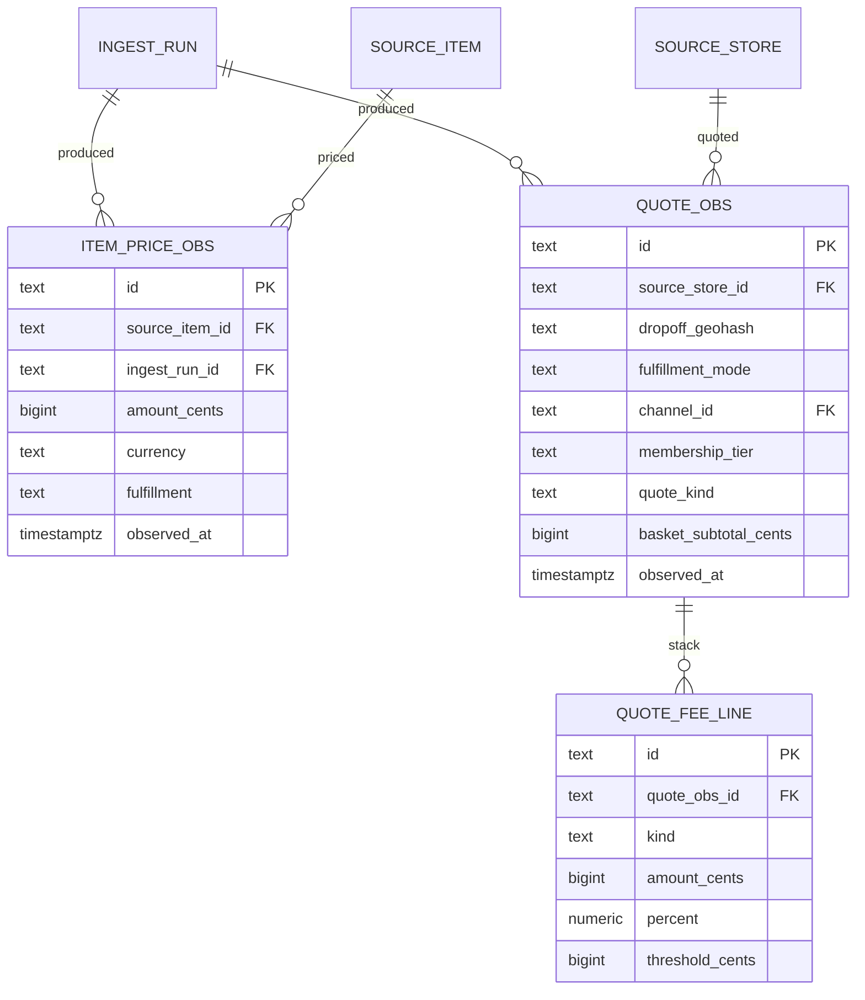
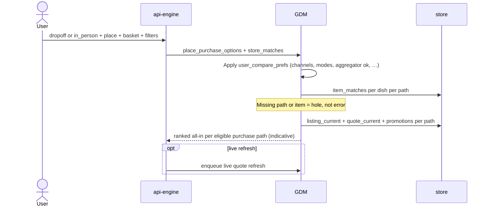
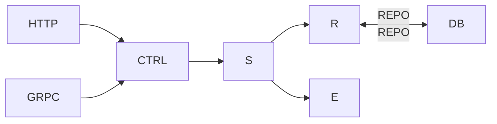

# Nibble data model (source of truth)

This document is the **single source of truth** for Nibble’s domain shape. Implementation follows this doc:

| Layer | Repo | Responsibility |
|-------|------|----------------|
| Domain (GDM) | `nibble-go-data-model` | Entities, value objects, repository ports, services |
| Persistence | `nibble-go-data-store` | Postgres schema (migrations) + repository adapters |
| Public HTTP | `nibble-api-engine` | REST handlers → domain services (future) |
| Ingest wire | `nibble-platform-contracts` | gRPC/protobuf; map into GDM at the edge |
| Browser types | `nibble-go-data-model/cmd/gentypes` | TS from Go entities (no duplicate shapes in web) |

When this doc changes, update **GDM → migrations → contracts → API** in that order (see [Change workflow](#change-workflow)).

**Status:** the [target model](#target-model) is planned SOT. **Entity diagram (visual SOT):** [data-model-diagram.md](./data-model-diagram.md). [As-implemented](#as-implemented-snapshot-legacy) is what ships today. Do not add features on the legacy `restaurants` / `offers` shapes.

---

## What Nibble actually is

Nibble is a **meta-pricing** product for **how you actually get food**, not a marketplace and not a restaurant CRM.

The user question is broader than three apps:

*For this address (or “I’m going in person”), this kitchen, this basket — among the ways I’m willing to order (Skip, DoorDash, merchant app, call-in, drive-thru, in-house delivery, pickup, in-store deals), what’s cheapest all-in right now?*

Aggregators are one slice. The same `place` can expose many **purchase paths**, each with its own menu, fees, and promos. The user **filters** which paths are even eligible (apps I use, delivery only, no third-party apps, drive-thru OK, etc.). The **recommendation** is whichever eligible path wins on price/deal (and later optional friction) — including “call the Chinese place” or “use the drive-thru” when that’s the best option, not when an app pays us.

The data model has to look like a **pricing warehouse + entity-resolution graph + path matrix**, not seven tidy business tables.

---

## Lineage (credit, then ours)

This problem is old. Metasearch already paid for the scars. We are **not** claiming we invented product-vs-offer, query-scoped quotes, or a fee stack. We also are **not** Kayak-for-food as a clone. Nibble is its own product: we took the shapes that work, added the planes and rules this domain actually needs, and refused to reinvent a wheel under a time crunch.

**Main inspiration — Kayak / Skyscanner.** Canonical thing vs many sellers’ **pricing options**. A fare without its **query** (market, dates, passengers) is not reproducible; our analog is dropoff, fulfillment, membership, basket. **Indicative** (cached) vs **live** quotes are different series and must not be mixed. Compare is a search, not a checkout cart.

**Also borrowed, with credit:**

| Source | What we took |
|--------|----------------|
| Google Shopping / Schema.org | **Product** (what it is) vs **Offer** (who sells it, price, availability). |
| Uber Eats INCA | **Product** vs **item/offering** (seller + fulfillment + price). Combos/variants as first-class catalog, not extra columns on a sandwich. |
| DoorDash, Uber Eats, Skip menu APIs | Menu is **categories → items → modifier groups → nested options**. Delivery vs pickup menus. The **fee stack** (delivery, service, small-order, tax, order minimum, ETA) is what “all-in” means. |

**What we added (Nibble, not a copy):**

- **Planes.** Source catalog, canonical graph, resolution, serviceability, observations, promos, user, read models — instead of one ER that pretends IDs already line up.
- **Raw ingest as sacred** (`ingest_runs`, `source_snapshots`). Pricing companies that throw away the payload cannot debug a mismatch.
- **Resolution as product data** (`store_matches`, `item_matches`, `match_evidence`, status/confidence). Unmatched listings stay first-class; we do not fake a join.
- **Food-delivery specifics:** service areas, hours, paused stores, public promos vs user-targeted coupons we will never see, declared memberships (DashPass etc.) as a quote dimension.
- **Meta-search user spine** (dropoffs, alerts, outbound hops) instead of marketplace orders/payments unless we become merchant of record.
- **Modifier matching deferred.** Persist source modifiers; do not canonicalize “add bacon” across apps in v1.

If a future reader has to choose: credit Kayak/Skyscanner for the spine, Google/Uber/DoorDash for catalog and fees, and Nibble for the plane split and the matching/honesty rules. We stood on that work so we could ship a model that answers all-in compare without spending the timeline rediscovering metasearch.

---

## Purchase paths (not “three delivery apps”)

A **purchase path** is one way to buy from a kitchen: a **surface** (where you order) plus a **fulfillment mode** (how food reaches you). Price and deals depend on both.

### Fulfillment (how food moves) vs delivery executor

**Fulfillment** is how food reaches the customer. **Delivery executor** (only when fulfillment is `delivery`) is who runs the courier leg. **Channel** is where you order (Skip, merchant app, …). Do not encode executor in the fulfillment string (no `delivery_3p`); store `delivery_executor` on purchase options, menus, and price/quote observations.

| Fulfillment | Examples | Quote needs dropoff? |
|-------------|----------|----------------------|
| `delivery` | Any delivered order | Yes |
| `pickup` | Order ahead, collect at counter | No (user may still set location for “near me”) |
| `drive_thru` | McD lane, no app vs brand app | No |
| `dine_in` | Menu / QR order (later) | No |
| `in_store` | Walk in, register price, loyalty tap | No |

| `delivery_executor` (when fulfillment = `delivery`) | Meaning |
|-----------------------------------------------------|---------|
| `third_party` | Aggregator / marketplace logistics (Skip, DD, UE) |
| `merchant` | Restaurant’s own drivers and zones |

At ingest, if `delivery_executor` is omitted for `delivery`, default from **`channels.kind`**: `aggregator` → `third_party`; merchant surfaces → `merchant` (override when the store uses white-label / Drive-style logistics).

Legacy combined values (`delivery_3p`, `delivery_merchant`, `in_person`) are normalized on write and in migration `0004_fulfillment_executor`.

### Surfaces (where you order)

| Surface kind | Examples |
|--------------|----------|
| `aggregator` | Skip, DoorDash, Uber Eats, … (extensible list) |
| `merchant_app` | McDonald’s app, Domino’s app |
| `merchant_web` | Restaurant online ordering |
| `phone` | Call-in (price may be “menu board” only) |
| `in_person` | Counter / drive-thru board (local store discount, cash price) |

`providers` in plane 1 generalizes to **`channels`**: every surface we can observe or model, not only aggregators. Aggregators are `channel_kind = aggregator`.

### Purchase option (the row you compare)

At a `place`, each comparable option is roughly:

```text
purchase_option = place + channel + fulfillment_mode + delivery_executor + source_store (if digital)
```

One kitchen can have many options:

```text
Tony’s Pizza (place)
  ├─ delivery + merchant + merchant_web   → Tony’s site, $3 delivery over 2km
  ├─ delivery + third_party + Skip        → higher menu + Skip fees
  ├─ pickup + merchant_app                → app pickup price
  └─ in_store + in_person channel         → counter / lunch special
```

Compare does not assume every option exists; **missing source data = column hidden or “unknown”**, not invented parity.

### User filters (compare query, not catalog)

Filters run **after** we know what paths exist, **before** we rank by all-in price. Stored per user (defaults) and overridable per compare session.

| Preference | Effect |
|------------|--------|
| Allowed / blocked **channels** | “I use Skip and Tony’s app only” |
| `willing_to_use_aggregator` | Hide all paths on `channels.kind = aggregator` if false |
| Allowed **fulfillment modes** | Delivery only, or pickup/drive-thru only, etc. |
| `merchant_direct_ok` | Include merchant web/app/phone/in-house delivery |
| `drive_thru_ok` / `in_store_ok` | Include non-app paths |
| Memberships declared | DashPass, Uber One, local loyalty → which quote series |



**Compare session** stores: dropoff (or “in person”), place, basket, **filter snapshot**, and optional `live_refresh`. Alerts (“tell me when Big Mac all-in drops”) use the same filter dimensions.

### Promos and “local store discounts”

Deals attach to a **path**, not generically to “the restaurant”:

- Aggregator: free delivery on Skip, % off in app.
- Merchant: “pickup 10%”, “Tuesday large pizza”, loyalty in brand app.
- In-store: may only exist as `in_person` menu observation or a posted promo — same `promotions` tables with `fulfillment_mode` + `channel_id` + optional `place_id`.

We still do not model **secret** targeted coupons without a user-connected session.

### Recommendations (we are not a delivery-app funnel)

Nibble’s output is a **recommendation**, not “open Skip.” The winning row can be anything the user allowed in their filters:

- **Drive-thru** — cheapest after fees, or only path with a known price for that basket.
- **Pickup** — beats 3P delivery once service/small-order fees are included.
- **Call the place** (`phone`) — menu-board or published phone price beats apps; we surface the number and *why* (e.g. “in-house delivery $2 vs Skip $12 fees”).
- **Merchant web / app** — in-house delivery deal, pickup discount, loyalty-visible promo.
- **Aggregator** — when it actually wins all-in, including DashPass-style membership the user declared.

The nuance is in the **reason**, not only the sort order:

| `recommendation_kind` (examples) | Typical rationale |
|----------------------------------|-----------------|
| `lowest_all_in` | Ranked #1 on total after fees + eligible public promos. |
| `in_house_deal` | Path wins because of a promotion or price only on merchant direct / in_store / phone. |
| `avoid_aggregator_fees` | Pickup or drive-thru saves $X vs best 3P delivery for same basket. |
| `merchant_delivery_wins` | Local Chinese / pizza own-delivery cheaper than 3P for this dropoff. |
| `data_gap` | We show a path but quote is indicative / incomplete — label honestly. |

Recommendations are **computed** by the compare service from ranked paths + promo metadata. **MVP:** persist only inside **`compare_sessions.result_snapshot`** (full API response JSON). No `recommendations` or `ranked_paths` tables unless analytics outgrows JSON queries.

Optional later: **effort / friction** (drive vs wait for delivery vs phone order) as a user-weighted tie-breaker when prices are within a threshold — still path-agnostic, not “prefer apps.” Default v1: **price + eligible deals first**, explain tradeoffs in copy.



**Outbound action** matches the path: deep link for digital channels, **phone number** for call-in, **directions / drive-thru** for in_person — stored as `outbound_clicks` with `action_kind` (`deep_link`, `tel`, `maps`, `none`).

### Compare API shape (illustrative)

Not implemented yet. Shapes below are the **target contract** for HTTP compare + what we persist on `compare_sessions`. Money is always `{ "amount_cents": int, "currency": "CAD" }`. IDs are Nibble ULIDs unless noted.

#### Request `POST /v1/compare`

```json
{
  "place_id": "01JPLACE8K2MCD123MAIN",
  "fulfillment_context": {
    "mode": "delivery",
    "dropoff": {
      "latitude": 45.9458,
      "longitude": -66.6414,
      "label": "UNBF"
    }
  },
  "basket": {
    "lines": [
      { "dish_id": "01JDISH_BIGMAC", "quantity": 1 },
      { "dish_id": "01JDISH_MEDFRIES", "quantity": 1 }
    ]
  },
  "filters": {
    "allowed_fulfillment_modes": [
      "delivery_3p",
      "delivery_merchant",
      "pickup",
      "drive_thru",
      "phone"
    ],
    "willing_to_use_aggregator": true,
    "allowed_channel_ids": null,
    "drive_thru_ok": true,
    "merchant_direct_ok": true
  },
  "memberships": ["dashpass"],
  "quote_preference": "indicative_first"
}
```

For pickup / drive-thru / in-store compare, use `fulfillment_context.mode`: `"in_person"` and omit `dropoff`, or pass user location only for distance sorting.

#### Response `200` — ranked paths + recommendation

```json
{
  "compare_session_id": "01JSESSION9X4K",
  "observed_at": "2026-09-26T16:45:00Z",
  "quote_preference_used": "indicative",
  "place": {
    "id": "01JPLACE8K2MCD123MAIN",
    "name": "McDonald's — Queen St",
    "brand_id": "01JBRAND_MCD"
  },
  "query_snapshot": {
    "dropoff_geohash": "f80t7",
    "filters": { "willing_to_use_aggregator": true, "drive_thru_ok": true },
    "memberships": ["dashpass"]
  },
  "basket_snapshot": {
    "lines": [
      { "dish_id": "01JDISH_BIGMAC", "name": "Big Mac", "quantity": 1 },
      { "dish_id": "01JDISH_MEDFRIES", "name": "Medium Fries", "quantity": 1 }
    ]
  },
  "paths_eligible": 5,
  "paths_ranked": 4,
  "paths_hidden": 1,
  "hidden_reasons": [
    {
      "purchase_option_id": "01JOPT_UBER_PICKUP",
      "code": "user_blocked_channel",
      "message": "Uber Eats not in allowed channels."
    }
  ],
  "recommendation": {
    "purchase_option_id": "01JOPT_MCD_DRIVE_THRU",
    "rank": 1,
    "kind": "avoid_aggregator_fees",
    "headline": "Drive-thru is cheapest",
    "confidence": "high",
    "all_in": { "amount_cents": 1247, "currency": "CAD" },
    "vs_runner_up": {
      "purchase_option_id": "01JOPT_SKIP_DELIVERY",
      "delta": { "amount_cents": -823, "currency": "CAD" },
      "label": "$8.23 less than Skip delivery"
    },
    "rationale_bullets": [
      "Menu total $12.47 — no delivery or service fees.",
      "Skip delivery would be $20.70 all-in for the same items.",
      "Prices indicative as of 16:42; live refresh available."
    ],
    "breakdown": {
      "item_subtotal": { "amount_cents": 1247, "currency": "CAD" },
      "modifier_total": { "amount_cents": 0, "currency": "CAD" },
      "delivery_fee": null,
      "service_fee": null,
      "small_order_fee": null,
      "tax": { "amount_cents": 0, "currency": "CAD" },
      "promo_discount": null,
      "order_minimum_met": true
    },
    "promotions_applied": [],
    "fulfillment_mode": "drive_thru",
    "channel": {
      "id": "01JCH_IN_PERSON",
      "kind": "in_person",
      "display_name": "Drive-thru / counter"
    },
    "action": {
      "kind": "maps",
      "label": "Get directions",
      "maps_url": "https://maps.example/?q=45.9458,-66.6414",
      "deep_link": null,
      "phone_e164": null
    },
    "data_quality": {
      "quote_kind": "indicative",
      "item_prices_observed_at": "2026-09-26T16:42:00Z",
      "quote_observed_at": null,
      "missing_line_items": []
    }
  },
  "runners_up": [
    {
      "purchase_option_id": "01JOPT_SKIP_DELIVERY",
      "rank": 2,
      "kind": "lowest_all_in",
      "headline": "Best app delivery",
      "confidence": "high",
      "all_in": { "amount_cents": 2070, "currency": "CAD" },
      "delta_vs_winner": { "amount_cents": 823, "currency": "CAD" },
      "rationale_bullets": [
        "DashPass applied — waived delivery fee.",
        "Service fee $3.49; menu prices higher than in-store."
      ],
      "fulfillment_mode": "delivery_3p",
      "channel": {
        "id": "01JCH_SKIP",
        "kind": "aggregator",
        "display_name": "SkipTheDishes"
      },
      "action": {
        "kind": "deep_link",
        "label": "Continue on Skip",
        "deep_link": "https://skipthedishes.com/…",
        "phone_e164": null,
        "maps_url": null
      },
      "data_quality": { "quote_kind": "indicative" }
    },
    {
      "purchase_option_id": "01JOPT_DD_DELIVERY",
      "rank": 3,
      "headline": "DoorDash",
      "confidence": "high",
      "all_in": { "amount_cents": 2199, "currency": "CAD" },
      "delta_vs_winner": { "amount_cents": 952, "currency": "CAD" },
      "rationale_bullets": [
        "No membership discount declared for DoorDash.",
        "Small-order fee applied — basket under $15."
      ],
      "fulfillment_mode": "delivery_3p",
      "channel": {
        "id": "01JCH_DOORDASH",
        "kind": "aggregator",
        "display_name": "DoorDash"
      },
      "action": {
        "kind": "deep_link",
        "label": "Continue on DoorDash",
        "deep_link": "https://doordash.com/…"
      },
      "data_quality": { "quote_kind": "indicative" }
    }
  ],
  "also_considered": [
    {
      "purchase_option_id": "01JOPT_MCD_PICKUP_APP",
      "rank": 4,
      "headline": "McDonald's app pickup",
      "all_in": { "amount_cents": 1299, "currency": "CAD" },
      "fulfillment_mode": "pickup",
      "channel": { "kind": "merchant_app", "display_name": "McDonald's app" },
      "action": { "kind": "deep_link", "label": "Open McDonald's app" },
      "note": "$0.52 more than drive-thru; order ahead and skip the line."
    }
  ],
  "unavailable_paths": [
    {
      "purchase_option_id": "01JOPT_UBER_DELIVERY",
      "code": "not_listed",
      "message": "This location is not on Uber Eats.",
      "fulfillment_mode": "delivery_3p",
      "channel": { "display_name": "Uber Eats" }
    }
  ],
  "live_refresh": {
    "available": true,
    "status": "not_requested",
    "poll_url": null
  }
}
```

#### Example B — merchant in-house deal wins (pizza)

Same request shape; excerpt showing **`in_house_deal`** winner and **phone** runner-up:

```json
{
  "place": {
    "id": "01JPLACE_TONYS",
    "name": "Tony's Pizza"
  },
  "recommendation": {
    "purchase_option_id": "01JOPT_TONY_WEB_DELIVERY",
    "kind": "in_house_deal",
    "headline": "Order from Tony's — Tuesday large deal",
    "all_in": { "amount_cents": 2899, "currency": "CAD" },
    "rationale_bullets": [
      "Tuesday large 2-topping $28.99 on tonys-pizza.example only.",
      "Skip would be $41.20 all-in for a comparable large.",
      "Merchant delivery fee $2.00 in your zone."
    ],
    "fulfillment_mode": "delivery_merchant",
    "channel": { "kind": "merchant_web", "display_name": "Tony's website" },
    "action": { "kind": "deep_link", "label": "Order on Tony's site", "deep_link": "https://tonys-pizza.example/…" },
    "promotions_applied": [
      {
        "promotion_id": "01JPROMO_TUES_LARGE",
        "name": "Tuesday large 2-topping",
        "discount": { "amount_cents": 500, "currency": "CAD" }
      }
    ]
  },
  "runners_up": [
    {
      "purchase_option_id": "01JOPT_TONY_PHONE",
      "rank": 2,
      "headline": "Call Tony's",
      "kind": "merchant_delivery_wins",
      "all_in": { "amount_cents": 3100, "currency": "CAD" },
      "confidence": "medium",
      "rationale_bullets": [
        "Phone menu price $31.00 + $2 delivery quoted on their site.",
        "Same deal may apply when you mention Tuesday special."
      ],
      "fulfillment_mode": "phone",
      "channel": { "kind": "phone", "display_name": "Phone order" },
      "action": {
        "kind": "tel",
        "label": "Call (604) 555-0199",
        "phone_e164": "+16045550199"
      },
      "data_quality": {
        "quote_kind": "indicative",
        "note": "Not a live checkout quote — confirm price when ordering."
      }
    }
  ]
}
```

#### Field notes (for implementers)

| Field | Rule |
|-------|------|
| `recommendation` | Always `paths_ranked[0]` after sort; duplicated for UI convenience. |
| `runners_up` | Next N paths (default 2–3) with full rationale. |
| `also_considered` | Lighter rows — close alternatives, optional friction copy. |
| `unavailable_paths` | Known option exists in catalog but not serviceable / not listed / basket gap. |
| `confidence` | `high` / `medium` / `low` from quote_kind + item match coverage + promo certainty. |
| `kind` | Machine tag for analytics; `headline` + `rationale_bullets` are user-facing. |
| `live_refresh` | Skyscanner-style: `POST` kicks job, `poll_url` returns updated `compare_session` snapshot. |

Persist the **entire** `POST /v1/compare` response body on `compare_sessions.result_snapshot` when the compare completes (MVP agreed). Re-fetch compare by `compare_session_id` reads this blob; live refresh overwrites it.

---

## System context



---

## Target model

### Planes, not a single ER

Expect **dozens of tables**. Group them so the graph stays thinkable. A row in a later plane may exist without a canonical match.



---

### Plane 0 — Ingest (raw is sacred)

A pricing company that normalizes away the payload cannot debug a mismatch.

| Table | Grain | Why |
|-------|--------|-----|
| `ingest_runs` | One collector pass | Provider, job type (`curated_seed` / `coverage_probe` / store list / menu / quote / promo), started/finished, counts, parser version. |
| `source_snapshots` | One payload | Raw JSON, checksum, `observed_at`, `provider_id`, `external_store_id`, content type. Never update in place. |

---

### Plane 1 — Source catalog (provider-native)

This is the **system of record** for “does Skip sell this.” Coverage holes are simply **missing source rows**, not flags on a McDonald’s record.

A store on DoorDash is not the same row as the kitchen on Skip, even if they are the same building. Same for “Big Mac” vs “Big Mac®”.



| Table | Grain |
|-------|--------|
| `channels` | Every order surface: aggregators, merchant apps, web, phone, in_person (replaces “providers only”). |
| `source_stores` | Unique `(channel, external_store_id)` — Skip store, DD store, Domino’s web store, etc. |
| `source_menus` | Menu for a **`fulfillment_mode`** (`delivery_3p`, `delivery_merchant`, `pickup`, `drive_thru`, …). Prices often differ per mode. |
| `place_purchase_options` | Optional link: `place_id` + `channel_id` + `fulfillment_mode` + `source_store_id` — which paths exist for this kitchen. |
| `source_categories` | Section on that menu |
| `source_items` | Item as listed (name, description, image URL, base price cache, available) |
| `source_modifier_groups` | “Choose size”, min/max selections |
| `source_modifier_options` | “Large”, nested groups, conditional price |
| `source_item_modifier_groups` | Which groups apply to which item |

**Do not** require a canonical dish to insert a source item. Unmatched menus are still browsable (“Skip’s menu for this store”).

---

### Plane 2 — Canonical graph (ours)

These rows are **claims we made**, not facts we scraped.

| Table | Grain | Notes |
|-------|--------|--------|
| `brands` | Chain / operator | McDonald’s. Independents may have no brand. |
| `places` | One physical kitchen | Lat/lng + address. This is “the store,” but it is **our** store. |
| `dishes` | One product identity | Big Mac as a concept. `brand_id` nullable. Store-specific specials can stay place-scoped. |
| `cuisines` / `categories` / `dietary_tags` | Facets | Attach via join tables to brand, place, or dish. |
| `dish_aliases` / `brand_aliases` | String variants | Matching fuel (“Big Mac Combo”, “McD”). |

Independents: one `places` row, dishes with `place_id` and null `brand_id`.

---

### Plane 3 — Resolution (this is the product)

Metasearch dies if you pretend IDs already line up. Matching is data: scored, reversible, reviewable.



| Table | Grain |
|-------|--------|
| `store_matches` | Proposed source_store → place. `status`: auto / confirmed / rejected / conflict. |
| `item_matches` | Proposed source_item → dish. Same status machine. |
| `match_evidence` | One signal: geo meters, name similarity, shared phone, embedding distance, human note. |

A Skip store with **no** `store_matches` row is not an error. Compare API can still show “Skip listing at this address” without joining to McDonald’s.

Modifier matching is **out of v1**. Compare default (no extras) or let the UI pick source-native options per provider. Canonicalizing “add bacon” across apps is its own research problem.

---

### Plane 4 — Serviceability

Coverage is geographic and temporal, not a boolean on the brand. There are **three layers**:

| Layer | Question | Table |
|-------|----------|--------|
| Nibble market | Do we operate here? | `markets` |
| Channel in market | Does Skip/DD even exist in this metro? | `channel_market_coverage` |
| Store service area | Does this kitchen deliver to this dropoff? | `service_areas` |

| Table | Grain |
|-------|--------|
| `markets` | One Nibble launch metro (slug, country, currency, timezone, geohash prefixes). |
| `market_probe_dropoffs` | Representative addresses for a market (UNBF, downtown, Regent). Used when a live coverage job exists. |
| `channel_market_coverage` | `(channel, market)` + status `expected` / `observed` / `absent` / `unknown`. |
| `service_areas` | `(source_store, fulfillment_mode)` + radius or polygon. Merchant delivery zones ≠ Skip zones. Dropoff outside = not covered. |
| `hours_regular` | Weekly intervals per source_store (and maybe per fulfillment). |
| `hours_exceptions` | Holidays / temporary. |
| `source_store_status` | Latest: paused, closed, `open_now` cache, `observed_at`. |

**How coverage is collected.** Acquisition adapters write this plane. v1 sources:

- **Curated seed** — city lists we maintain (`expected`). First market: Fredericton (UNBF hackathon).
- Official partner / merchant APIs later, when a kitchen or platform signed us. Not another consumer food app.

Do not treat missing `service_areas` as “not covered”; unknown store zones currently **allow** (see serviceability). Channel-in-market `absent` is what hides a whole aggregator in a city.

---

### Plane 5 — Observations (the pricing warehouse)

Two different facts, never one `offers` row:

1. **Item price** — what the menu said this dish costs (base, or a configured item).
2. **Quote** — checkout economics for a **query**: dropoff, fulfillment, time, membership, basket subtotal.

Kayak’s rule applies: **a quote without its query is not reproducible.** Dropoff, **fulfillment_mode**, **channel**, membership, and basket subtotal all change the number. Pickup and drive-thru quotes may omit dropoff but still need channel + mode + time.



`quote_kind`: `indicative` (cached / last seen) vs `live` (fresh). Do not mix series in charts.

`quote_fee_line.kind` values we care about (aggregator fee-stack shaped):

`item_subtotal` · `modifier` · `delivery` · `service` · `small_order` · `tax` · `promo` · `membership` · `order_minimum` · `eta_minutes` (eta is not money; store on the quote header).

All-in compare = configured item prices + fee stack − public promos. **Menu price only is a toy metric.**

---

### Plane 6 — Public promotions

Promos are not list prices. They are also not the same as **user-targeted** coupons we will never scrape.

| Table | Grain |
|-------|--------|
| `promotions` | One public campaign on a **channel** (window, kind, applicable `fulfillment_mode`s). |
| `promotion_constraints` | Min subtotal, code, first-order, membership required, max discount, in_store_only, pickup_only, etc. |
| `promotion_targets` | Optional: place, source_store, source_item, brand, category. Null = channel-wide. |
| `membership_products` | DashPass, Uber One, brand loyalty — catalog of products, not user subscription rows. |

Eligibility for a **compare** uses public promotions + the user’s declared memberships (plane 7). Hidden DoorDash targeted offers are out of scope until we have a user-connected session.

---

### Plane 7 — User (meta-search, not checkout)

If we do not merchant-of-record, **do not build marketplace order/payment as the spine.**

| Table | Grain |
|-------|--------|
| `users` | Person |
| `user_settings` | 1:1 scalars (currency, notifications) + **`compare_prefs` JSONB** (MVP — see below) |
| `user_dropoffs` | Saved addresses / current dropoff (this **is** the quote query) |
| `user_memberships` | Declared DashPass, loyalty, etc. — selects quote series |
| `user_compare_prefs` | *(Target diagram only.)* Split table later if we need indexing/constraints on filters. **Ship:** embed in `user_settings.compare_prefs`. |
| `user_channel_blocks` | *(Defer.)* Use `compare_prefs.blocked_channel_ids` in JSON until needed. |
| `user_dietary_prefs` | Tags |
| `watchlists` / `price_alerts` | All-in threshold per place/dish/**path filter** (same dimensions as compare) |
| `compare_sessions` | `query_snapshot`, `basket_snapshot`, **`result_snapshot` JSONB** (full compare API response — recommendation, runners_up, unavailable_paths, etc.) |
| `outbound_clicks` | Per path: `deep_link`, `tel`, `maps`, attribution — not only aggregator URLs |
| `attributed_purchases` | Optional post-hop receipt if we ever get it — **not** an order we fulfill |

Cart in this product is a **comparison basket**: canonical `place` + list of `dishes` (or unmatched `source_items`). The engine fans out to each **eligible purchase option** (channel × fulfillment_mode × source_store), applies user filters, then builds an all-in quote per path. That is closer to a Kayak search than a DoorDash cart.

Payment methods / place-order tables wait until (if) Nibble charges.

---

### Plane 8 — Read models (derived, disposable)

Not source of truth. Rebuild from observations.

| Table / view | Purpose |
|--------------|--------|
| `listing_current` | Latest item price + availability per `source_item` |
| `quote_current` | Latest indicative quote per `(source_store, geohash, fulfillment_mode, channel, membership, basket_bucket)` |
| `place_path_matrix` | Places × eligible purchase options × “serviceable for this geohash/mode” |

Compare API reads these, then optionally kicks a **live** quote refresh (Skyscanner create/poll).

---

### How a compare actually runs



---

## Table inventory (expected, not exhaustive)

Rough count if we build the planes above: **~40–50 tables**, plus joins. That is normal. Do not collapse planes to “keep it simple”; the simple model is what we have now and it cannot answer all-in compare.

| Plane | Tables (approx) |
|-------|-----------------|
| 0 Ingest | `ingest_runs`, `source_snapshots` |
| 1 Source | `channels`, `source_stores`, `place_purchase_options`, `source_menus`, categories/items/modifiers |
| 2 Canonical | `brands`, `places`, `dishes`, `cuisines`, `categories`, `dietary_tags`, join tables, `*_aliases` |
| 3 Resolution | `store_matches`, `item_matches`, `match_evidence` |
| 4 Serviceability | `markets`, `market_probe_dropoffs`, `channel_market_coverage`, `service_areas`, `hours_regular`, `hours_exceptions`, `source_store_status` |
| 5 Pricing | `item_price_observations`, `quote_observations`, `quote_fee_lines` |
| 6 Promos | `promotions`, `promotion_constraints`, `promotion_targets`, `membership_products` |
| 7 User | `users`, `user_settings` (+ `compare_prefs` JSONB), `user_dropoffs`, `user_memberships`, `compare_sessions` (+ `result_snapshot` JSONB), `outbound_clicks`; alerts deferred |
| 8 Read | `listing_current`, `quote_current`, `place_path_matrix` |

---

## Mapping from earlier drafts

| Earlier name | Where it actually lives |
|--------------|-------------------------|
| STORE | Canonical `places` **and** `source_stores`. Two tables. |
| BRAND / COMPANY | `brands` (canonical only). Source stores have a name string until matched. |
| PROVIDERS | `channels` where `channel_kind = aggregator` (Skip, DD, …) |
| FOOD | Canonical `dishes` + source `source_items` + `item_matches`. Not one table. |
| Offers | Split: coverage is source rows; price is `item_price_observations`; checkout is `quote_observations`. |
| Deals | `promotions` + constraints + targets (public only). |
| USERS / SETTINGS | Plane 7 |
| USER_PURCHASES | `outbound_clicks` / `attributed_purchases`, not marketplace orders. |
| Cart / Order GDM today | Comparison basket + hop, unless we become MoR. |

---

## Decisions locked for Phase 1 catalog slice

These are fixed for ingest + `GET /v1/.../source-stores` + menu browse until we revisit compare quotes.

| # | Decision |
|---|----------|
| D21 | Fulfillment uses `fulfillment_mode` + `delivery_executor` (see migration 0004); no combined `delivery_3p` strings in new code. |
| D27 | Fredericton launch data comes from **curated ingest** (`ACQUISITION_ADAPTER=curated`: markets + compare catalog), not live partner APIs. |
| D15 (v1) | Quote lookup key includes `source_store`, `channel`, fulfillment path, `dropoff_geohash` (5-char for demo), `membership_tier`, `basket_subtotal_cents` on the observation row. |
| Aggregators | `channel.kind = aggregator` for Skip, DoorDash, Uber Eats; compare filters use `willing_to_use_aggregator`. |
| D19 | Compare remains **one place** + basket of `dish_id` lines; catalog browse is per **source store** on a channel. |
| D22 | In-person prices live on a **separate `source_store`** on the `in_person` / store channel, priced with `item_price_observations` like any other path. No price rows on `places`. |
| D23 | Filters are **opt-in for aggregators, open for everything else**: aggregator paths are dropped unless `willing_to_use_aggregator = true`; other paths show when observed. Empty request filters fall back to the signed-in user's `compare_prefs`. |
| D24 | **Strict item parity**: each basket line resolves `dish_id` → `source_item` per store via `item_matches`. A path with any unmatched or unpriced line goes to `unavailable_paths` (`basket_unpriced`); no "closest item" substitution in v1. |
| D25 | Recommendation = **lowest all-in** (item subtotal + quote fee lines). Remaining ranked paths are `runners_up`; no friction weighting in v1. |
| D26 | Confidence per path: `high` when a quote observation matched the D15 key; `low` when the quote is missing or a delivery path has no dropoff. Phone / published-menu paths have no live quote, so they rank on item prices at `low` confidence. |

Still open and not blocking Phase 1/2 catalog work: D16 (indicative vs live labelling), D17 (match thresholds), D18 (modifiers), D20 (raw payload retention).

---

## Open decisions

| # | Topic | Draft |
|---|--------|--------|
| D1 | IDs | Nibble ULID on every table. Provider ids only on source rows (`external_*`). |
| D3 | History | Append-only snapshots + observations. Current prices are read models. |
| D8 | Currency | Required on every money observation. No table default. |
| D10 | Fulfillment | Meta-pricing + outbound hop. No payment spine until MoR. |
| D12 | Promo stacking | v1: one item-scoped + one fee-scoped public promo. |
| D16 | **Indicative vs live** | Store both; UI labels them; charts use one series. |
| D17 | **Match threshold** | Auto-link stores above confidence X; items above Y; else unmatched. Human review queue. |
| D18 | **Modifiers** | Persist source modifiers. Do not canonicalize in v1. Compare base item. |
| D20 | **Raw payload retention** | Hot: 14 days full JSON. Cold: checksum + S3 later. |

D15, D19, D21–D27 moved to [Decisions locked for Phase 1 catalog slice](#decisions-locked-for-phase-1-catalog-slice).

---

## GDM contexts (target)

Align packages to planes, not to today’s folders.

| GDM context | Owns |
|-------------|------|
| `channel` | Surfaces (aggregators + merchant + in_person) |
| `source` | Source store/menu/item/modifiers |
| `brand` / `place` / `dish` | Canonical graph |
| `resolution` | Matches, evidence, alias application |
| `observation` | Item prices, quotes, fee lines |
| `promotion` | Public promos |
| `market` | Launch geos, probe dropoffs, channel-in-market coverage |
| `serviceability` | Hours, store areas, status |
| `ingest` | Runs (or keep this in acquisition + store only) |
| `user` | Settings, dropoffs, memberships, alerts |
| `compare` | Filter paths + all-in math + **recommendation** (winner + rationale; session snapshot) |

`money.Money`, `location.Location` stay value objects.

---

## Capabilities this model unlocks

- Browse a provider’s real menu with holes intact.
- “Same kitchen” only when `store_matches` says so.
- Path-agnostic **recommendations**: drive-thru, pickup, phone, merchant in-house deal, or an app — whichever wins for this user’s filters.
- All-in compare across purchase paths, with **why** (fees avoided, in-house promo, merchant delivery vs 3P).
- Price history per source item (and per dish once matched).
- Honest unmatched state instead of fake joins.
- Live refresh without throwing away indicative history.

---

## Change workflow

1. Edit this file.
2. GDM entities + repository ports.
3. New migrations in `nibble-go-data-store` (never rewrite shipped SQL).
4. Store adapters.
5. Services (matcher, quote assembly).
6. Contracts when wire changes.
7. API engine mapping; no SQL in engine.
8. gentypes + web.

---

## MVP shortcuts (agreed vs open)

| Shortcut | Status |
|----------|--------|
| **Compare filters in `user_settings.compare_prefs` JSONB** | **Agreed** — same fields as compare API `filters`; per-request overrides still allowed. |
| **Full compare response in `compare_sessions.result_snapshot` JSONB** | **Agreed** — same shape as `POST /v1/compare` response; no `recommendations` / `ranked_paths` tables in MVP. |
| Skip `listing_current` / `quote_current` tables | Open — use latest observation queries until slow. |
| Skip canonical matching in v1 | Open — limits cross-app “same dish” compare. |
| Single-aggregator ingest first | Open — product choice, not schema. |

**`compare_prefs` shape (v1):**

```json
{
  "allowed_fulfillment_modes": ["delivery_3p", "pickup"],
  "willing_to_use_aggregator": true,
  "allowed_channel_ids": null,
  "blocked_channel_ids": [],
  "drive_thru_ok": false,
  "merchant_direct_ok": true
}
```

Validate in the compare service (GDM), not with Postgres check constraints on JSON.

**`compare_sessions` columns (MVP):**

| Column | Contents |
|--------|----------|
| `query_snapshot` | dropoff / in_person, filters used, memberships |
| `basket_snapshot` | dish lines at compare time |
| `result_snapshot` | full compare API response (`recommendation`, `runners_up`, `also_considered`, `unavailable_paths`, `live_refresh`, …) |

`GET /v1/compare/sessions/{id}` returns `result_snapshot` (and ids/timestamps). Analytics can export JSON later; normalize tables only if we need SQL over winners.

---

## Phased plan

### Phase 0 — Paper

- [x] Planes + inventory in this doc
- [x] Purchase paths, user filters, path-agnostic recommendations
- [x] Illustrative compare API request/response ([Compare API shape](#compare-api-shape-illustrative))
- [x] Visual entity diagram ([data-model-diagram.md](./data-model-diagram.md))
- [x] Close D15–D26 (quote grain, paths, recommendations, phone confidence, filters) — D16–D18, D20 stay open, non-blocking
- [x] Repository signatures per context ([repository-signatures.md](./repository-signatures.md))
- [x] Promote compare JSON to `nibble-platform-contracts` OpenAPI (`openapi/compare/v1/openapi.yaml`)

### Phase 1 — Channels + source catalog + ingest

- `channels` (aggregator, merchant_app, merchant_web, phone, in_person).
- `markets` + probe dropoffs + `channel_market_coverage` (Fredericton / UNBF first).
- Replace legacy restaurant/menu/offer with `source_stores`, menus per `fulfillment_mode`, items, modifiers.
- `ingest_runs` + `source_snapshots` on every parse (`curated_seed`, later store list / menu / quote).
- Curated Fredericton coverage seed; live ingest only from sources Nibble is allowed to call.
- `item_price_observations` per `source_item`.
- `place_purchase_options` stub (manual or inferred paths per place).
- gRPC ingest maps into source plane + markets; HTTP read: single-channel menu browse.

### Phase 2 — Quotes + fee stack + single-path compare

- `quote_observations` + `quote_fee_lines` keyed by channel, `fulfillment_mode`, dropoff geohash (or in_person).
- Indicative all-in for one `source_store` at a time (no cross-provider matching yet).
- `listing_current` read model.

### Phase 3 — Canonical graph + resolution

- `brands`, `places`, `dishes`, taxonomies, aliases.
- `store_matches`, `item_matches`, `match_evidence`.
- Compare fan-out: same basket across matched paths at one place.

### Phase 4 — User prefs + multi-path compare + recommendations

- `users`, `user_dropoffs`, `user_settings.compare_prefs` (JSONB), `user_memberships`.
- Compare service: filter eligible paths → rank all-in → `recommendation` + runners-up (see API shape).
- `compare_sessions` with `query_snapshot`, `basket_snapshot`, **`result_snapshot`** (full compare response JSON); `outbound_clicks` with `deep_link` / `tel` / `maps`.
- `POST /v1/compare` in api-engine (wired to compare service).

### Phase 5 — Promos + memberships on quotes

- `promotions`, constraints, targets scoped to channel + fulfillment + place.
- `membership_products`; promos applied in compare breakdown.
- Recommendation kinds: `in_house_deal`, `merchant_delivery_wins`, etc.

### Phase 6 — Serviceability + read models + live refresh

- `service_areas`, hours, `source_store_status`; `place_path_matrix`.
- `quote_current`; Skyscanner-style live refresh poll on compare session.
- Price alerts / watchlists using same filter dimensions as compare.

### Phase 7 — Web + gentypes

- gentypes from GDM; compare UI (winner, rationale, runners-up, unavailable paths).
- Legacy `accounts` / `carts` / `orders` retired or bridged only if MoR changes.

---

## Hexagonal placement



`CTRL` in `nibble-api-engine`. `S` / `R` / `E` in GDM. `REPO` / `DB` in data-store.

---

## As-implemented snapshot (legacy)

Today: `restaurants`, `menu_items`, `offers`, `price_observations`, storefront junctions, `accounts` / `carts` / `orders`. Ingest is `RecordRestaurant` / `MenuItem` / `Offer` / `PriceObservation`. Frozen until Phase 1.

---

## Related docs

- [data-model-diagram.md](./data-model-diagram.md) — full entity diagram (visual SOT)
- [versioning.md](./versioning.md) — module tags and bump order
